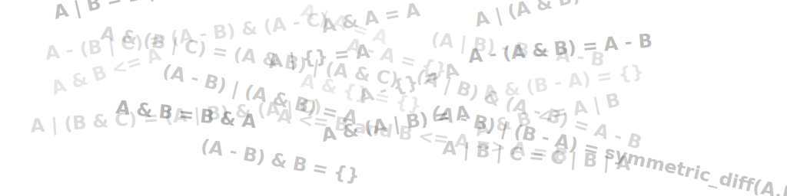

# set-algebra-solver-py



A small set algebra workbench in Python for parsing expressions and checking identity behavior under different set relationships.

I first picked this project up in March 2025 around the Gemini 2.5 release. During a drive cleanup, I found it again and resumed development.

## Run

Use `uv` to run the CLI:

```bash
uv run set-algebra-solver
```

Pass a custom expression:

```bash
uv run set-algebra-solver "A ∩ (B ∪ C) = (A ∩ B) ∪ (A ∩ C)"
```

Use a custom candidate universe:

```bash
uv run set-algebra-solver "A - B = B - A" --universe 1,2,3,4
```

## Tests

Run the full test suite:

```bash
uv run --extra dev pytest
```

## Docs

Planned and implemented features are tracked in `docs/FEATURES.md`.
Project intent speculation is tracked in `docs/INTENT_SPECULATION.md`.
